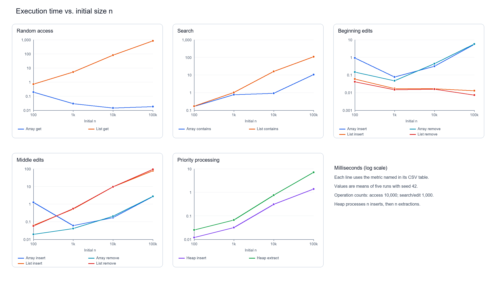
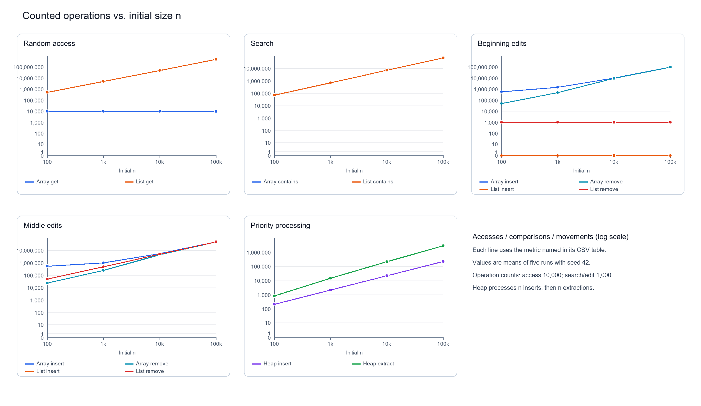

# Assignment 2 — Algorithmic Analysis

Sabyr Aslan · SE-2528 · [GitHub](https://github.com/asikxz008/Assigment2-daa-Aslan)

## Overview

Java implementations of a dynamic array, singly linked list with a tail pointer, and binary min-heap. The project tests correctness and compares predicted costs with four measured workloads.

Run from the repository root (Java 11 or newer):

```text
javac -d out src/*.java
java -cp out Tests
java -cp out Benchmark
```

The benchmark overwrites the four CSV tables in `results/tables/`. The committed plots show the recorded run.

## Complexity Analysis

`n` is the current size. `Θ(f)` is a tight bound, so it implies both `O(f)` and `Ω(f)`. Average indexed operations assume a uniformly chosen valid index; searches assume a fixed proportion of hits and misses. Auxiliary space excludes stored elements and includes temporary resizing copies.

| Structure | Operation | Best | Average | Worst | Auxiliary space |
|---|---|---:|---:|---:|---:|
| Array | `add(x)` | Θ(1) | Θ(1) amortized | Θ(n) resize | O(n) resize; O(1) otherwise |
| Array | `add(i,x)` | Θ(1) | Θ(n) | Θ(n) | O(n) resize; O(1) otherwise |
| Array | `remove(i)` | Θ(1) | Θ(n) | Θ(n) | Θ(1) |
| Array | `get(i)` | Θ(1) | Θ(1) | Θ(1) | Θ(1) |
| Array | `contains(x)` | Θ(1) | Θ(n) | Θ(n) | Θ(1) |
| List | `add(x)` | Θ(1) | Θ(1) | Θ(1) | Θ(1) |
| List | `add(i,x)` | Θ(1) | Θ(n) | Θ(n) | Θ(1) |
| List | `remove(i)` | Θ(1) | Θ(n) | Θ(n) | Θ(1) |
| List | `get(i)` | Θ(1) | Θ(n) | Θ(n) | Θ(1) |
| List | `contains(x)` | Θ(1) | Θ(n) | Θ(n) | Θ(1) |
| Heap | `insert(x)` | Θ(1) | Θ(1) expected* | Θ(n) resize; Θ(log n) otherwise | O(n) resize; O(1) otherwise |
| Heap | `peekMin()` | Θ(1) | Θ(1) | Θ(1) | Θ(1) |
| Heap | `extractMin()` | Θ(1) | Θ(log n) | Θ(log n) | Θ(1) |

Array indexing reads one location; list indexing follows links. Indexed array edits shift a suffix, while list edits change a few links after locating the position; the tail pointer makes append constant time. Both searches scan until a match or the end. A heap has height `⌊log₂ n⌋`; insertion moves upward and extraction downward. Geometric growth makes array/heap copying O(1) amortized per append. *For independent random keys, expected heap sift-up length is constant; without that input model, its bound is Ω(1) and O(log n) with spare capacity.*

## Correctness

**Array `add(i,x)` invariant.** Let the old entries be `a₀…aₙ₋₁`. At the start of shift-loop iteration `j`, positions before `j` hold their old entries, and positions after `j` hold the old suffix shifted one place right.

1. **Initialization:** At `j=n`, the whole old prefix is unchanged and the shifted suffix is empty.
2. **Maintenance:** Copying `aⱼ₋₁` into position `j` and decrementing `j` extends the shifted suffix by one while preserving the prefix.
3. **Termination:** `j` decreases to `i`; then positions before `i` are unchanged and positions after `i` contain the correctly shifted suffix.
4. **Conclusion:** Writing `x` at `i` and increasing size gives exactly `a₀…aᵢ₋₁,x,aᵢ…aₙ₋₁`, including the append case `i=n`.

**Heap `insert(x)` invariant.** The implementation keeps `x` in a local variable and moves a logical hole upward. At each loop start, every old key occurs once outside the hole, keys along its downward path have shifted one level, and every parent-child relation between occupied slots satisfies heap order.

1. **Initialization:** The new last slot is the hole; all old heap relations still hold.
2. **Maintenance:** If parent key `y>x`, copying `y` into the hole preserves all old keys and moves the hole to the parent. `y` was no greater than the occupied keys below it, so occupied heap relations remain valid.
3. **Termination:** Each move decreases the nonnegative hole index; the loop stops at the root or when its parent is at most `x`.
4. **Conclusion:** Writing `x` into the hole makes its parent edge valid. If the hole moved, its path child exceeded `x`, and any sibling was at least the old parent key; if it did not move, it is a leaf. Thus both child edges are valid. All other edges satisfy the invariant. The complete-tree shape and key multiset are preserved, including duplicates.

## Experimental Setup

For every applicable workload, `n = 100, 1,000, 10,000, 100,000`; five runs use the same `Random(42)` data. `System.nanoTime()` measures operations only, with input generation, structure construction, printing, and extraction-order verification outside timing. Values are in `[0, 2n)`.

| Workload | Operations (`m`) | Recorded metric |
|---|---|---|
| Random access | 10,000 random `get` indices | Array reads / list node visits |
| Search | 1,000 `contains` queries: half present, half negative and absent | Value comparisons |
| Insertion/removal | 1,000 of each at `0` and fixed `n/2` | Array element moves / list node visits |
| Priority processing | `n` inserts, then `n` extractions | Heap value comparisons |

Array movements include resize copies. The assignment requests 1,000 removals even for `n=100`; whenever an index becomes invalid, the original `n` elements are restored outside timing and removals continue in another timed batch. This rule is applied at every size.

## Results

Complete tables include `n`, five-run mean milliseconds, metric count, and workload complexity: [random access](results/tables/random_access.csv), [search](results/tables/search.csv), [insertion/removal](results/tables/insertion_removal.csv), [priority processing](results/tables/priority_processing.csv).

| At `n=100,000` | Dynamic array | Linked list | Min-heap |
|---|---:|---:|---:|
| 10,000 random reads | 0.018 ms; 10,000 accesses | 827.775 ms; 504,933,532 visits | — |
| 1,000 searches | 10.459 ms; 71,335,329 comparisons | 107.819 ms; 71,335,329 comparisons | — |
| 1,000 beginning inserts | 5.400 ms; 100,499,500 moves | 0.013 ms; 0 traversed nodes | — |
| 1,000 beginning removals | 5.694 ms; 99,499,500 moves | 0.007 ms; 1,000 visits | — |
| 1,000 middle inserts | 2.680 ms; 50,499,500 moves | 77.522 ms; 50,000,000 visits | — |
| 1,000 middle removals | 2.716 ms; 49,499,500 moves | 92.749 ms; 50,001,000 visits | — |
| `n` heap inserts | — | — | 1.400 ms; 229,018 comparisons |
| `n` heap extractions | — | — | 7.141 ms; 2,831,804 comparisons |





## Discussion

As `n` grows, list random access and both searches perform more visits/comparisons; array random access stays at 10,000 reads. Beginning edits shift more array elements but remain constant-work head edits for the list. Middle edits grow for both: shifts in the array, traversal in the list. Heap insert comparisons grew from 217 to 229,018, close to linear for random keys; extraction comparisons grew from 858 to 2,831,804, consistent with `n log n`.

These counts agree with the theoretical bounds. Small timings depart from smooth curves (for example, array access at `n=100` is slower than at larger sizes) because of JVM warm-up, timer overhead, and allocation/GC effects. Equal Big-O and even equal comparison counts need not mean equal time: at `n=100,000`, the array search is about 10× faster than the list search because contiguous array reads have better locality than pointer traversal. Resizing and allocation also change constant costs.

## Design Recommendations

Use the dynamic array for indexed access and typically for scans; use the linked list for frequent head inserts/removals when the position is already known. For a fixed middle index, locating the list node can dominate and the array may be faster. Use the heap for repeated minimum retrieval and extraction. Choose by the actual mix of operations and `n`.

## Conclusion

The measured counts support the predicted growth, while timings show that memory layout and JVM effects matter alongside asymptotic complexity.
